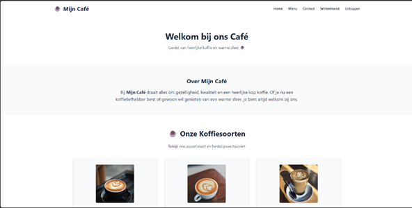

# Mijn Café

Een Laravel 12 project voor het vak *Backend Web* – een dynamische website voor een koffiebar met gebruikersbeheer, nieuws, bestellingen en meer.

<<<<<<< Updated upstream
# Inhoud
=======
## Inhoud
>>>>>>> Stashed changes

- [Beschrijving](#beschrijving)
- [Functionaliteiten](#functionaliteiten)
- [Installatie](#installatie)
- [Gebruikersaccounts](#gebruikersaccounts)
- [Screenshots](#screenshots)
- [Bronnen](#bronnen)

---

<<<<<<< Updated upstream
# Beschrijving
=======
## Beschrijving
>>>>>>> Stashed changes

Mijn Café is een full-stack Laravel webapplicatie gebouwd als eindproject voor het vak Backend Web. De website combineert gebruikersauthenticatie, profielbeheer, koffiebestellingen, nieuwsbeheer, FAQ-beheer en een contactformulier in een gebruiksvriendelijke en overzichtelijke interface.

Gebruikers kunnen inloggen, hun profiel beheren, bestellingen plaatsen en vragen stellen via het contactformulier of FAQ. Admins hebben extra rechten zoals het beheren van gebruikers, het toekennen van adminrechten, het verwerken van contactberichten, het beheren van FAQ’s en het aanmaken van nieuwsitems die op de homepage verschijnen.

---

<<<<<<< Updated upstream
# Functionaliteiten

# Algemene functies
=======
## Functionaliteiten

### Algemene functies
>>>>>>> Stashed changes
- *Homepage met dynamische inhoud:* toont koffiesoorten (met afbeelding), recente nieuwsitems en veelgestelde vragen.
- *Contactformulier:* bezoekers kunnen berichten sturen; admins ontvangen deze via e-mail.
- *Publieke profielpagina’s:* elke gebruiker heeft een publiek profiel met foto, bio en info.

<<<<<<< Updated upstream
# Authenticatie & Gebruikersbeheer
=======
### Authenticatie & Gebruikersbeheer
>>>>>>> Stashed changes
- *Registratie en login* met wachtwoordbeveiliging en ‘wachtwoord vergeten’-functie.
- *Gebruikersdashboard* na inloggen.
- *Profiel aanpassen:* naam, gebruikersnaam, profielfoto, bio, verjaardag.
- *Admins kunnen gebruikers beheren* (aanmaken, wijzigen, verwijderen).
- *Adminrechten toekennen/intrekken*.

<<<<<<< Updated upstream
# Bestellingen
=======
### Bestellingen
>>>>>>> Stashed changes
- *Koffies bestellen:* via een dynamisch menu.
- *Mijn bestellingen:* overzicht voor elke gebruiker.
- *Bestelbeheer:* admins kunnen alle bestellingen bekijken.

<<<<<<< Updated upstream
# Nieuwsbeheer
=======
### Nieuwsbeheer
>>>>>>> Stashed changes
- *Nieuws aanmaken, bewerken, verwijderen* door admins.
- *Nieuwsitems bevatten:* titel, content, afbeelding, publicatiedatum, auteur.
- *Nieuwsweergave op homepage* en aparte nieuwssectie.
- *Detailpagina per nieuwsitem.*
<<<<<<< Updated upstream

# FAQ-beheer
- *Adminbeheer:* beheer van categorieën en Q&A.
- *FAQ’s zichtbaar op homepage* gegroepeerd per categorie.
- *Bezoekers kunnen vragen insturen*, zichtbaar voor admin in dashboard.

---

# Installatie

1. *Clone deze repository:*

   ```bash
   git clone https://github.com/kiranchaudry97/Mijn-Cafe.git
   cd Mijn-Cafe

# Afbeeldingen 
# Hoofd pagina
# inhoud welkom bericht met menu en de item die ze kunnen bestellen.

 
# veelgestelde vragen kunnen weergeven
 
 
# Veelgestelde vragen kunne stellen
  

# Menu pagina 
 
 
# Contactinfo pagina
  
 
# formulier kunnen versturen 
  

# Admin login
 
  

# Admin dashboard
  

# Admin kunnen nieuws beheer kunnen weergeven  en kunnen toevoegen 
 
   
    
     

# Admin user gebruikers kunnen weergeven  en zich kunnen aanpassen
 
  


# Admin kunnen bestelling zien van de gebruikers 
 
  


# admin kunnen contact inzeddingen zien 
 


  


# Als Admin faq pagina kunnen beheren  en kunnen toevoegen en weergeven op de hoofdpagina
 
  

  

  


# log gegevens van gebruiker 
   


# gebruikers dashboard 
 
  
# gebruikers hun profile kunnen wijzigen 
 
  


# bestellingen kunnen nemen via de mijn bestelling 
   

# nieuwe gebruikers kunnen aanmaken 
   

# profile kunnen bewereken als admin 
 
  
# wacthwoord kunnen wjizingen of account kunnen vewijderen
  


=======

### FAQ-beheer
- *Adminbeheer:* beheer van categorieën en Q&A.
- *FAQ’s zichtbaar op homepage* gegroepeerd per categorie.
- *Bezoekers kunnen vragen insturen*, zichtbaar voor admin in dashboard.

---

## Installatie

1. *Clone deze repository:*

   ```bash
   git clone https://github.com/kiranchaudry97/Mijn-Cafe.git
   cd Mijn-Cafe

# Afbeeldingen 
# Hoofd pagina
# inhoud welkom bericht met menu en de item die ze kunnen bestellen.

 
# veelgestelde vragen kunnen weergeven
 

#Veelgestelde vragen kunne stellen
 

#Menu pagina 
 
#Contactinfo pagina
 

#formulier kunnen versturen 
 

#Admin login
 


#Admin dashboard
 


#Admin kunnen nieuws beheer kunnen weergeven  en kunnen toevoegen 
 
 
 


#Admin user gebruikers kunnen weergeven  en zich kunnen aanpassen
 


#Admin kunnen bestelling zien van de gebruikers 
 


#admin kunnen contact inzeddingen zien 
 


#Als Admin faq pagina kunnen beheren  en kunnen toevoegen en weergeven op de hoofdpagina
 


 


 


#log gegevens van gebruiker 
 


#gebruikers dashboard 
 

#gebruikers hun profile kunnen wijzigen 
 


#bestellingen kunnen nemen via de mijn bestelling 
 

#nieuwe gebruikers kunnen aanmaken 
 

#profile kunnen bewereken als admin 
 

#wacthwoord kunnen wjizingen of account kunnen vewijderen
 


[def]: image.png
>>>>>>> Stashed changes
